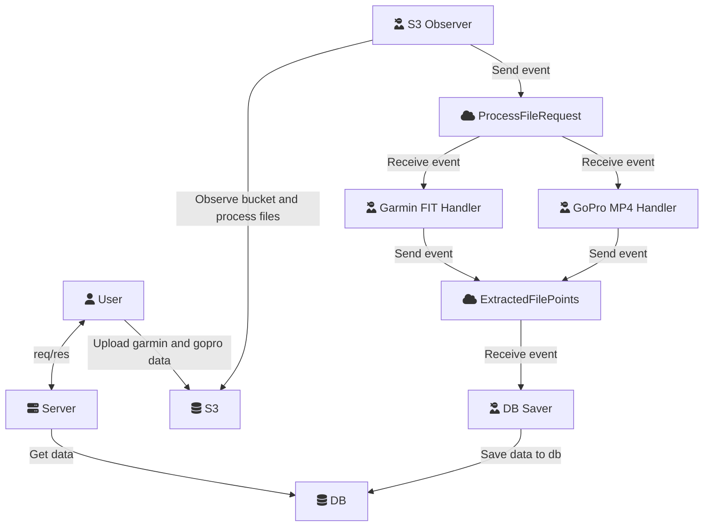

# Seen Places

Project for learning. Main goal is to create a system for storing geo data from different files and display them on a map in an efficient way with options like checking when given place was visited, viewing a video from the place if available, etc. For now I'm trying to handle `garmin` fit format and mp4s recorded using a `GoPro` with GPS data.

Main learning goal is to get familiar with `postgis` and geographical formats/libraries/specs etc. Maybe in the future it'll be a good starting point for some integrations with `QGIS`.

Initial architecture is as follows:

`Postgres` with `Postgis` extension is used as a database. `Rabbitmq` is used as the broker layer for sending and receiving events. Most of the code will be written in `go`, with the exception of the format handlers: `garmin` files handler is written in `python`, `gopro` files handler – in `typescript` (it was the quickest way with the libraries I found). `Protobuf` is used for shared event definitions.

## TODOs

* add docker compose
* try using devcontainer
* go dockerfile
* helm chart
* update dockerfiles not to use root
* update makefile so it's not a mess
* write proper sql queries
* add checks for data integrity
* comments
* tests?